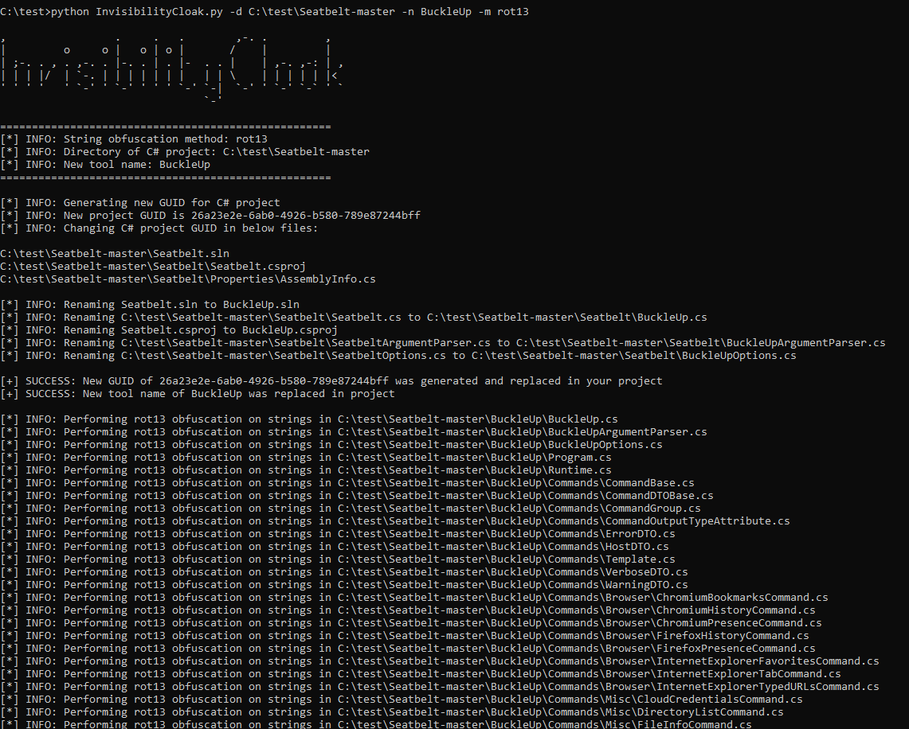
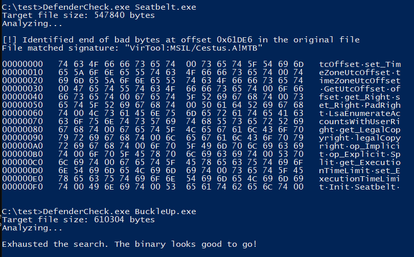

# InvisibilityCloak
Proof-of-concept obfuscation toolkit for C# post-exploitation tools. This will perform the below actions for a C# visual studio project.

* Change the tool name
* Change the project GUID
* Obfuscate compatible strings in source code files based on obfuscation method entered by user
* Removes one-line comments (e.g. // this is a comment)
* Remove PDB string option for compiled release .NET assembly

**Blog Post:** https://securityintelligence.com/posts/invisibility-cloak-obfuscate-c-tools-evade-signature-based-detection

## String Candidates Not Obfuscated
The below string candidates are not included in obfuscation
* Strings less than 3 characters
* Strings using string interpolation (e.g., `Console.WriteLine($"Hello, {name}! Today is {date.DayOfWeek}, it's {date:HH:mm} now.");`)
* Case statements as they need to be static values
* Const vars as they need to be static values
* Strings in method signatures as they need to be static values
* Line with `" => "` as used in switch statement and needs to be static value.
* ` is ` in an if statement when doing comparison as the values compared must be static
* Strings within Regexes
* Override strings as they need to be static values
* The below random edge cases for strings, as they have caused issues when encoding/decoding
  * String starting with or ending with `'`
  * `""'` in the line
  * `+ @"` in the line
  * `"""` in the line
  * `""` in the line
  * `Encoding.Unicode.GetString` in the line
  * `Encoding.ASCII.GetBytes` in the line
  * Line starting with `"` and ending with `")]`. This is typically used for command line switches and needs to be static value.

## Support Information
* Windows
* Linux (Debian-based systems)
* Python3

## Arguments/Options

* `-d, --directory` - directory where your visual studio project is located
* `-m, --method` - obfuscation method (base64, rot13, reverse)
* `-n, --name` - name of your new tool
* `-h, --help` - help menu
* `--version` - get version of tool

## Usage/Examples

### Run InvisibilityCloak with string obfuscation

**Base64 String Obfuscation**

`python InvisibilityCloak.py -d /path/to/project -n "TotallyLegitTool" -m base64`

`python InvisibilityCloak.py -d C:\path\to\project -n "TotallyLegitTool" -m base64`

**ROT13 String Obfuscation**

`python InvisibilityCloak.py -d /path/to/project -n "TotallyLegitTool" -m rot13`

`python InvisibilityCloak.py -d C:\path\to\project -n "TotallyLegitTool" -m rot13`

**Reverse String Obfuscation**

`python InvisibilityCloak.py -d /path/to/project -n "TotallyLegitTool" -m reverse`

`python InvisibilityCloak.py -d C:\path\to\project -n "TotallyLegitTool" -m reverse`

### Run InvisibilityCloak without string obfuscation

`python InvisibilityCloak.py -d /path/to/project -n "TotallyLegitTool"`

`python InvisibilityCloak.py -d C:\path\to\project -n "TotallyLegitTool"`

## Output

Below is what the output would look like when running the tool.

Below is the difference in Seatbelt between unobfuscated and then obfuscated version with InvisibilityCloak against Microsoft Defender using [Defender Check](https://github.com/matterpreter/DefenderCheck).

